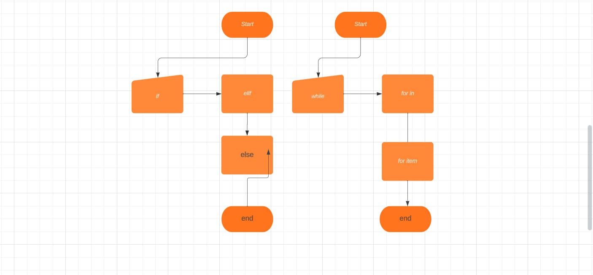

<h>LANGKAH LANGKAH STRUKTUR KONDISI<h>

if adalah struktur kondisi dasar ia mengeksekusi blok kode yang ada di bawahnya hanya jika kondisi yang diberikan bernilai True.

Elif Singkatan dari "else if". Ini digunakan untuk memeriksa kondisi lain jika kondisi dalam jika sebelumnya bernilai False.

Else Blok kode di bawah else akan dijalankan jika semua kondisi dalam if dan elif sebelumnya bernilai False.

<h>LANGKAH-LANGKAH PERULANGAN<h>
Perulangan dengan "untuk"

Perulangan dengan sementara

Kontrol Perulangan

<h>flowchart<h>

